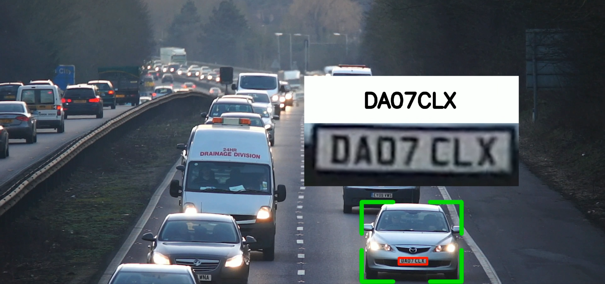

# Number Plate Recognition

Este projeto consiste no desenvolvimento de um sistema de reconhecimento de placas veiculares utilizando técnicas de visão computacional e aprendizado de máquina. O sistema detecta veículos, identifica suas placas e realiza o tracking em vídeos ou imagens em tempo real.

## Tecnologias usadas

- Python
- YOLOv8: Para detecção de placas veiculares
- SORT (Simple Online and Realtime Tracking): Para realizar o tracking dos veículos detectados. Repositório: https://github.com/abewley/sort
- OpenCV: Para manipulação de imagens e vídeos.

## Exemplo de funcionamento

